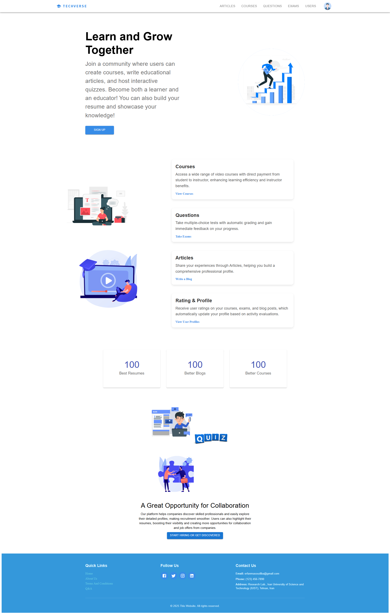
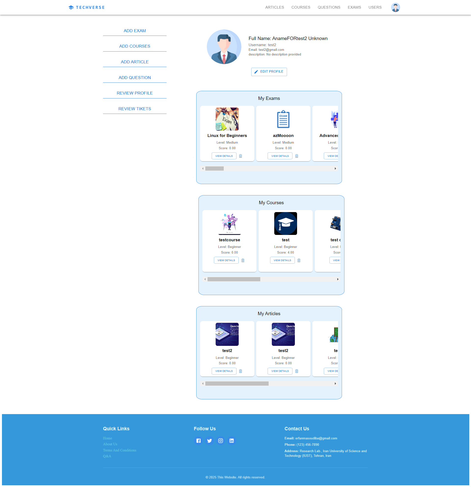
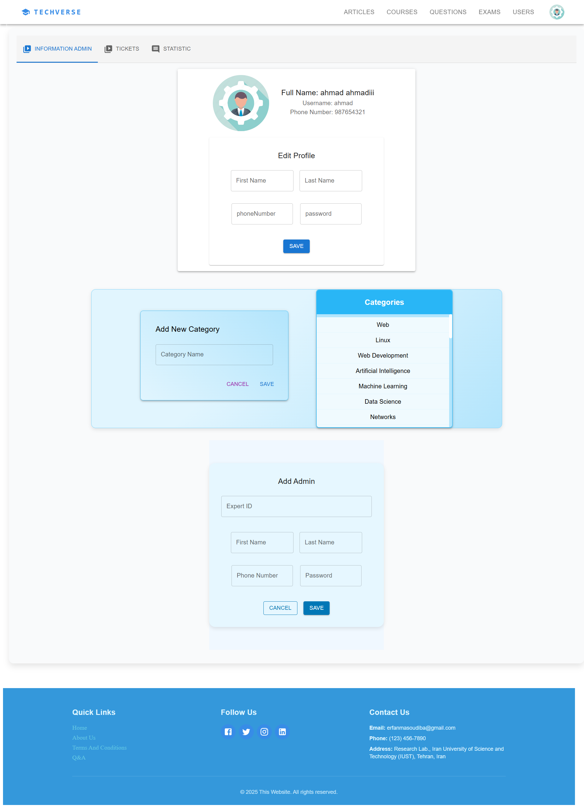
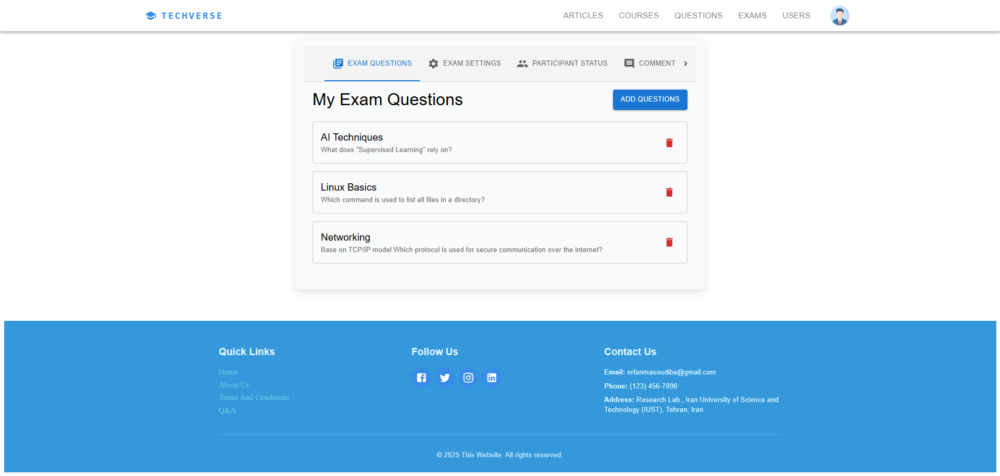
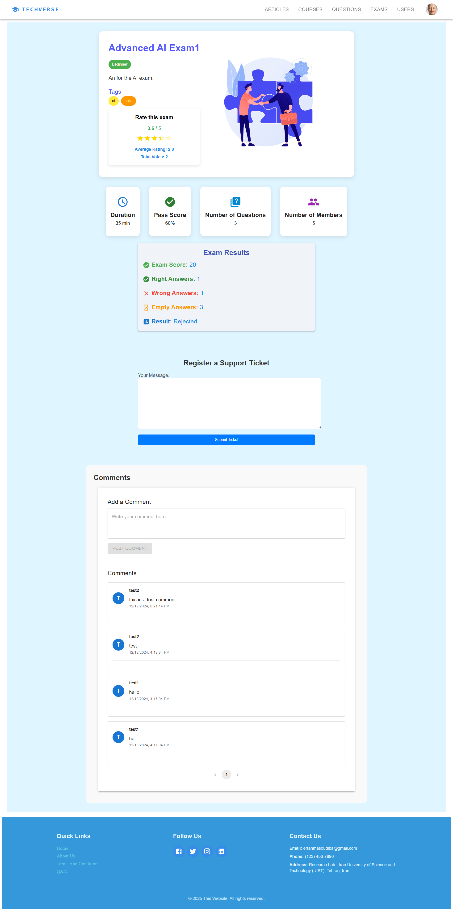

# SAD_Enjoyers Frontend Repository

Welcome to the **SAD_Enjoyers** frontend repository! This is the frontend service for our project, implemented using **React.js** with **Vite** for fast and optimized development.

## Overview

This repository contains the user interface of the SAD_Enjoyers application, which communicates with the backend via API endpoints. The frontend is designed to be responsive, efficient, and user-friendly.

The **SAD_Enjoyers** project consists of two main repositories:

1. [Backend Repository](https://github.com/SAD-Enjoyers/SAD_Backend)
2. Frontend Repository (this repository)

## Table of Contents

- [Features](#features)
- [Project Structure](#project-structure)
- [Technologies](#technologies)
- [Installation](#installation)
- [Environment Setup](#environment-setup)
- [Usage](#usage)
- [Contributing](#contributing)

## Features

- Built with **React.js** and **Vite** for optimal performance
- Modular component-based architecture
- State management using **React Context API / Redux**
- API integration with backend services
- Secure authentication and authorization
- Responsive UI with **Material-UI (MUI)**
- Routing with **React Router**

## Project Structure

Repository structure is like this:

```
frontend/
├── src/
│   ├── assets/            # Static files (images, icons, etc.)
│   ├── common/            # Common components shared across features
│   ├── features/          # Feature-based components
│   │   ├── Admin/         # Admin-related components
│   │   ├── Articles/      # Articles-related components
│   │   ├── Auth/          # Authentication components
│   │   ├── Courses/       # Courses-related components
│   │   ├── Exams/         # Exam-related components
│   │   ├── Home/          # Home page components
│   │   ├── Questions/     # Question-related components
│   │   ├── Resources/     # Resources-related components
│   │   └── Users/         # User-related components
│   ├── App.css            # Global styles
│   ├── App.jsx            # Main application component
│   ├── index.css          # Global CSS file
│   ├── main.jsx           # Entry point for React & Vite
│   ├── routes.jsx         # Route configurations
│   └── theme.js           # Theme customization
├── public/                # Static public files
├── tests/                 # Test files
├── .env                   # Environment variables
├── eslint.config.js       # ESLint configuration
├── vite.config.js         # Vite configuration file
├── index.html             # Main HTML template
├── package.json           # Dependencies and scripts
├── package-lock.json      # Locked dependencies
└── README.md              # This file
```

## Technologies

- **React.js** - Frontend framework
- **Vite** - Build tool for fast development
- **Material-UI (MUI)** - UI component library
- **React Router** - Client-side routing
- **Axios** - HTTP requests
- **React Context API / Redux** - State management

## Installation

1. **Clone the repository:**

   ```bash
   git clone https://github.com/SAD-Enjoyers/SAD_Frontend
   cd frontend
   ```

2. **Install dependencies:**

   - Install NodeJS version 20.18.0

   ```bash
   npm install
   ```

## Environment Setup

1. **Create a `.env` file** by copying `.env.example`:

   ```bash
   cp .env.example .env
   ```

2. **Set environment variables**:
   - Define `VITE_API_BASE_URL` for backend API communication
   - Set authentication-related values if needed

## Usage

- **Start the development server**:

  ```bash
  npm run dev
  ```

- The application will be accessible at `http://localhost:5173` (or the specified port).

- **Build for production**:

  ```bash
  npm run build
  ```

- **Run tests**:

  ```bash
  npm run test
  ```

## Contributing

We welcome contributions to this project! Please follow these steps:

1. Fork this repository.
2. Create a new branch with a descriptive name.
3. Make changes and commit.
4. Submit a pull request for review.

## Screenshots

Here are some previews of the application:

### Main Page

This is the homepage of our application, showcasing the interface and main features.



---

### Profile Page

The profile page where users can view and manage their personal information.



---

### Admin Page

The admin dashboard, where administrators can manage users, content, and analytics.



---

### Private Services Page

A preview of one of the private services pages, demonstrating advanced features.



### Public Services Page

A glimpse of one of the public services pages, highlighting the services available to all users.



---

Thank you for being a part of **SAD_Enjoyers**!
